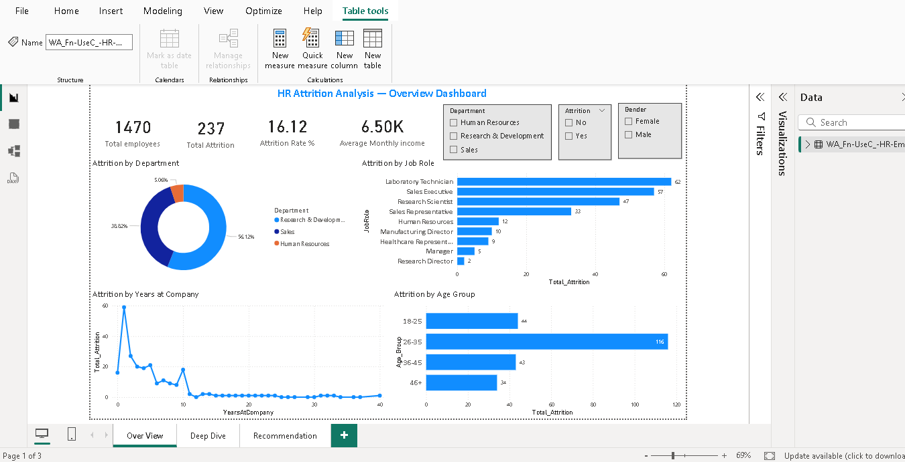
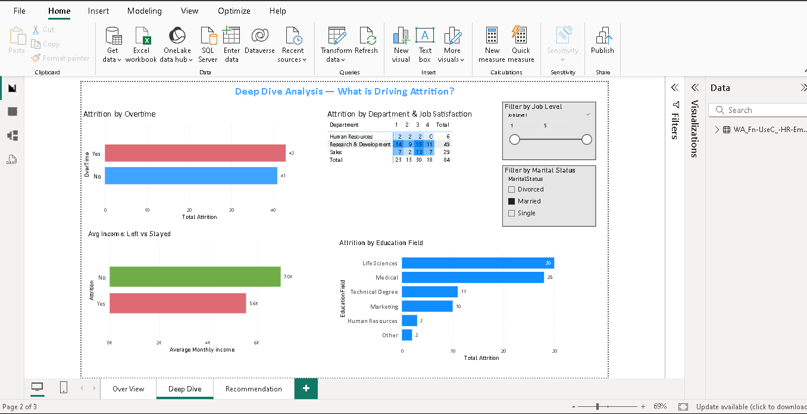
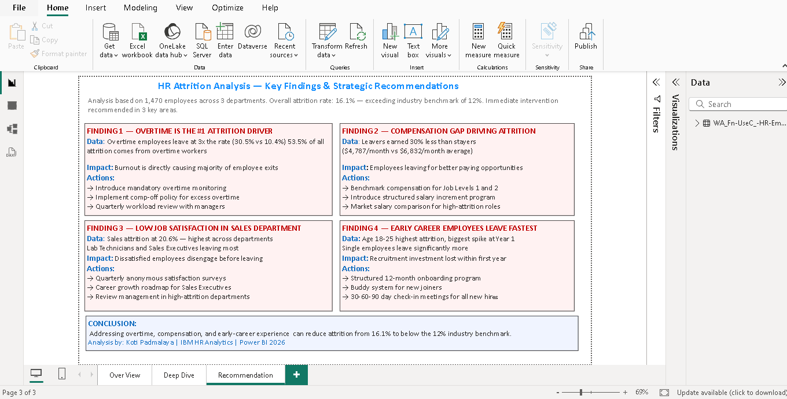

# HR Employee Attrition Analysis 📊

## Project Overview
Analysed IBM HR dataset of 1,470 employees across 3 departments 
to identify key attrition drivers and built a 3-page interactive 
Power BI dashboard for HR decision-making.

## Problem Statement
The organisation has a 16.1% attrition rate — exceeding the 
industry benchmark of 12%. This analysis identifies root causes 
and provides actionable recommendations.

## Tools Used
- Power BI — 3 page interactive dashboard
- DAX — Calculated measures and columns
- Advanced Excel — Initial data exploration

## Dataset
- Source: IBM HR Analytics Employee Attrition Dataset (Kaggle)
- Size: 1,470 employees | 35 attributes
- Key column: Attrition (Yes/No)

## Dashboard Pages

### Page 1 — Overview Dashboard
KPI cards showing total employees, attrition count, 
attrition rate and average income. Charts showing 
attrition by department, job role, age group and 
years at company with interactive slicers.

### Page 2 — Deep Dive Analysis
Overtime impact analysis, job satisfaction matrix 
with heatmap, income comparison between leavers 
and stayers, attrition by education field.

### Page 3 — Key Findings & Recommendations
4 strategic findings with data proof and actionable 
HR recommendations to reduce attrition below 12%.

## Key Findings
- Overtime employees leave at 3x the rate (30.5% vs 10.4%)
- Leavers earned 30% less than stayers ($4,787 vs $6,832/month)
- Sales department highest attrition at 20.6%
- Age 18-25 employees have highest attrition spike at Year 1

## Dashboard Preview

### Page 1 — Overview

### Page 2 — Deep Dive Analysis

### Page 3 — Recommendations

## Business Recommendations
1. Introduce overtime monitoring and comp-off policy
2. Benchmark compensation for Job Levels 1 and 2
3. Conduct quarterly satisfaction surveys in Sales
4. Implement 12-month onboarding program for new joiners

## Contact
**Koti Padmalaya**
Email: padmalaya766@gmail.com
LinkedIn: [Connect with me](www.linkedin.com/in/koti-padmalaya-b53b41364)
